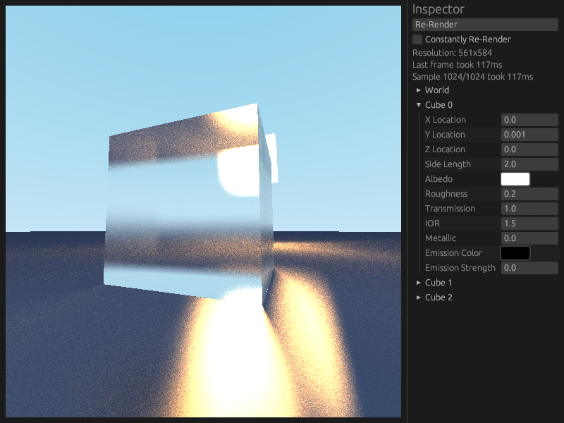

# Raydar

Raydar is an early-stage physically-based production renderer written in Rust.



## Features

- Sphere and Cube primitive geometries
- Diffuse, Specular, Metal and Glass materials
- CPU backend
- Native GPU backend (Vulkan)
- Graphical scene editor

## Usage

Download the latest release from the [releases tab](https://github.com/bvpav/raydar/releases) and extract it. You'll find two binaries:

### Headless Renderer (`raydar`)

Renders a scene to an image file:

```bash
./raydar [FLAGS] [scene-file]

# Example: Render scene.rscn with 512 samples using CPU
./raydar --cpu --max-sample-count 512 scene.rscn
```

### Scene Editor (`raydar_editor`)

Interactive editor for creating and modifying scenes:

```bash
./raydar_editor [FLAGS] [scene-file]

# Example: Open scene.rscn with 8 light bounces using CPU
./raydar_editor --cpu --max-bounces 8 scene.rscn
```

### Common Flags

Both binaries accept these flags:

- `--cpu` - Use CPU renderer instead of Vulkan
- `--max-sample-count <N>` - Maximum samples per pixel (default: 1024)
- `--max-bounces <N>` - Maximum light bounces per ray (default: 12)

### Additional Flags for Headless Renderer

- `-o, --output <FILE>` - Output image path (default: output.png)

## Building from Source

See [BUILDING.md](BUILDING.md) for detailed build instructions, including:

- Prerequisites and dependencies
- Build options for development and production
- Troubleshooting common issues

For quick development builds:

```bash
# Run headless renderer
cargo run -- [FLAGS] [scene-file]

# Run editor
cargo run --bin raydar_editor -- [FLAGS] [scene-file]
```
